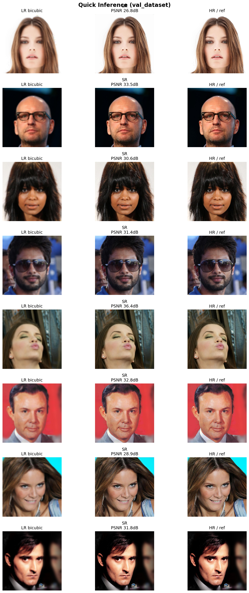

# Super-Resolution Prototype (PyTorch)

This is a working prototype for a Single Image Super-Resolution (SISR) model I'm experimenting with.
It's currently a raw notebook focused on architecture implementation and training dynamics on the CelebA dataset.

### Technical Approach
The goal is to upscale low-res facial images (128x128) by a factor of 4x (to 512x512).

* **Upsampling Strategy:** Instead of standard Deconvolution (ConvTranspose), I implemented **PixelShuffle** (Sub-Pixel Convolution). This allows the model to learn upscaling filters directly in the low-resolution space, significantly reducing computational cost and checkerboard artifacts.
* **Loss Function:** Optimized using **L1 Loss** to encourage sharper edge reconstruction compared to MSE (which typically results in blurry textures).

###  Model 
The architecture is designed for efficiency, prioritizing feature density over depth.

* **Feature Extraction:** The entry block projects RGB inputs into **64 Feature Maps** using a large receptive field (`kernel_size=5`). This allows the network to capture broader spatial context immediately.
* **Upsampling Strategy:** Implemented **Sub-Pixel Convolution** (PixelShuffle). Unlike standard interpolation, the model learns the upscaling filters directly in the feature space, expanding channels before rearranging them into pixels.
* **Refinement:** A sequence of **Residual Blocks (ResBlocks)** with Group Normalization processes the features to recover high-frequency details. 
* **Parameter Count:** **134,199**. Extremely lightweight compared to VGG-based SR models (often >1M params).
* **Hardware Setup:** Training pipeline parallelized on a **Dual-GPU** cluster via `torch.nn.DataParallel`.
* 
### Dataset
* **CelebA**: Used for training faces, handling resizing and gaussian blurring on-the-fly to create Low-Res/High-Res pairs.

### Status
This is a work-in-progress draft. The code includes the full training loop, model definition, and data loading pipeline in a single notebook.

---

### Visual Results (WIP)
Preliminary results from the latest training epoch.

**Sample 1: LR Input vs Model Output (SR) vs Ground Truth (HR)**

**Sample 2:**

